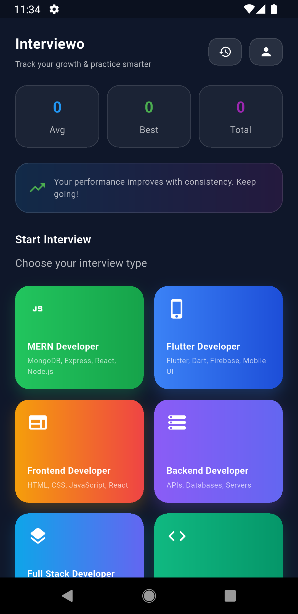
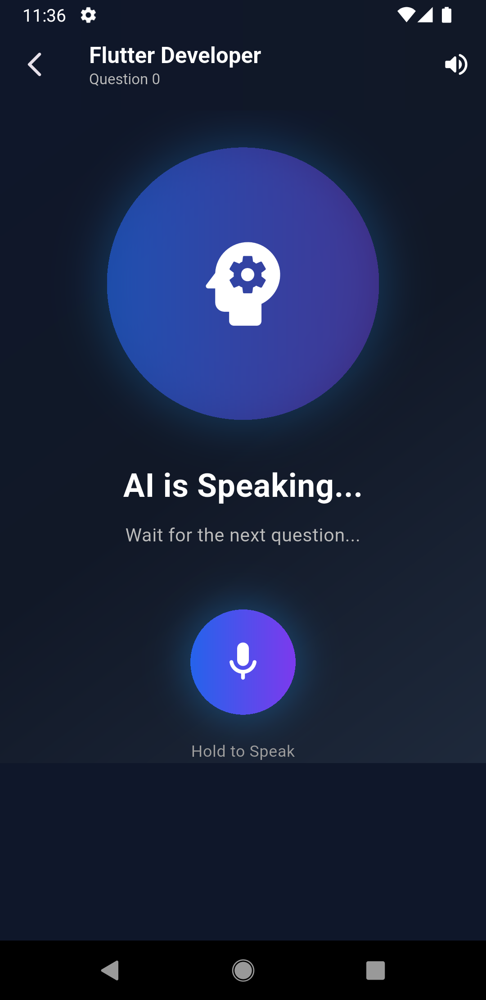
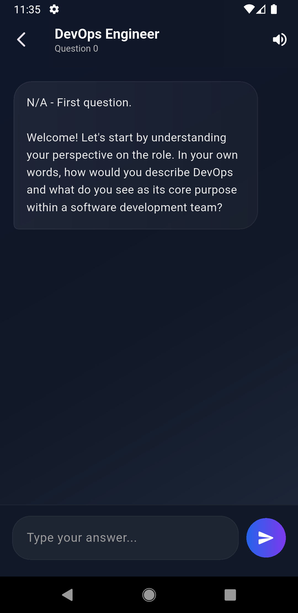

# 🚀 Interviewo

### *Your Personal AI Interview Coach*

Interviewo is an AI-powered interview preparation application that helps users practice real-world technical and HR interviews. Whether you're preparing for your first job, an internship, or your next career move, Interviewo provides an interactive interview experience with intelligent feedback to improve your confidence and communication skills.

---

## 📸 Preview

|            Home           |          Mock Interview        |         Chat Interview        |
| :-----------------------: | :----------------------------: | :-------------------------: |
|  | ..... |  |

---

## ✨ Highlights

* 🤖 AI-powered interview sessions
* 💬 Chat Interview Mode
* 🎙️ Voice Interview Mode
* 👨‍💻 Role-based interview questions
* 🛠️ Skill-focused interview preparation
* 📄 Job Description based interview flow
* 📈 Instant answer evaluation
* 📝 Personalized interview feedback
* 🎯 Performance score after every interview
* 💡 Suggestions to improve weak areas
* 📊 Clean and modern user interface

---

## 🛠️ Tech Stack

| Technology             | Details                   |
| ---------------------- | ------------------------- |
| **Framework**          | Flutter 3.29.1            |
| **Language**           | Dart                      |
| **State Management**   | GetX                      |
| **AI Integration**     | Google Gemini             |
| **Speech Recognition** | Speech to Text            |
| **Text to Speech**     | Flutter TTS               |
| **Networking**         | HTTP                      |
| **Local Storage**      | Get Storage               |
| **Charts**             | Syncfusion Flutter Charts |

---

## 📦 Packages Used

* get
* get_storage
* google_generative_ai
* speech_to_text
* flutter_tts
* permission_handler
* flutter_screenutil
* syncfusion_flutter_charts
* http
* animate_do
* shimmer
* flutter_spinkit
* intl

---

## 📥 Installation

Clone the repository

```bash
git clone https://github.com/AdityaRaj9889/Interviewo.git
```

Move into the project

```bash
cd interviewo
```

Install dependencies

```bash
flutter pub get
```

Run the application

```bash
flutter run
```

---

## 🔑 API Key Setup

Generate your Gemini API Key from:

**https://aistudio.google.com/apikey**

Open:

```text
lib/app/services/ai_service.dart
```

Replace:

```dart
final String _apiKey = 'YOUR_GEMINI_API_KEY';
```

with your own API Key.

---

## 📱 App Details

| Property                 | Value          |
| ------------------------ | -------------- |
| **Application**          | Interviewo     |
| **Version**              | 1.0.0          |
| **Flutter Version**      | 3.29.1         |
| **Programming Language** | Dart           |
| **State Management**     | GetX           |
| **AI Model**             | Google Gemini  |
| **Interview Modes**      | Chat & Voice   |
| **Interview Types**      | Technical & HR |
| **Supported Platforms**  | Android & iOS  |

---

## 💙 Why Interviewo?

Interviewo is built to simulate a real interview environment where users can practice at their own pace. The application generates interview questions based on the selected role, skills, and experience level, evaluates responses in real time, and provides meaningful feedback to help users improve communication, technical knowledge, and overall interview performance.

---

## ⭐ Show Your Support

If you found this project helpful, don't forget to **⭐ Star** the repository on GitHub.

**Made with ❤️ using Flutter**
